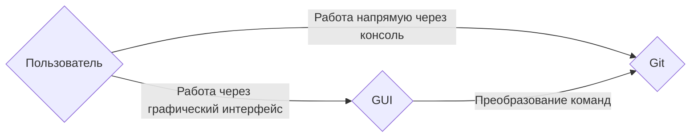

### Git
Система контроля версий, или VCS (SCM), — программа, позволяющая контролировать изменения в проекте. 
Позволяет хранить, изменять, анализировать историю проектов. 
Позволяет объединять результаты работы нескольких человек. 

[Источник информации](https://practicum.yandex.ru/trainer/git-basics/lesson/ef1ee07a-f2d3-4e6b-9ed5-0e65fbec93fd/)

Основные функции системы контроля версий:
•	хранит историю изменений в виде отдельных ревизий;
•	позволяет манипулировать историей: например, менять порядок ревизий, полностью удалять версии, возвращаться назад в истории;
•	помогает анализировать изменения: например, кто и когда вносит изменения, кто чаще всего вносит изменения в определённый файл и так далее.

поддержка параллельной работы нескольких пользователей, в том числе над одним файлом.

Установка Git:

В macOS и Linux все установлено.

В Windows:
[Источник информации](https://practicum.yandex.ru/trainer/git-basics/lesson/2a82ddb7-19cf-437e-a187-f976804fddad/)

C Git можно работать через GUI (графический интерфейс) или через GLI (командную строку)

Состояния (статусы), в которых могут находиться файлы в репозитории: 
**•	untracked** («неотслеживаемый») 
Git «видит», что такой файл существует, но не следит за изменениями в нем. 
Нет предыдущих версий, зафиксированных через «git commit» | «git add». 
__•	staged__ («подготовленный») | index | cache 
После выполнения команды «git add» файл попадает в staging area («промежуточную область»), 
то есть в список файлов, которые войдут в коммит. 
**•	tracked** («отслеживаемый») 
Git «видит», что такой файл существует и следит за изменениями в нем. 
Файл зафиксирован через «git commit» | «git add». 
**•	modified** («измененный») 
Файл закоммичен и изменен. 
